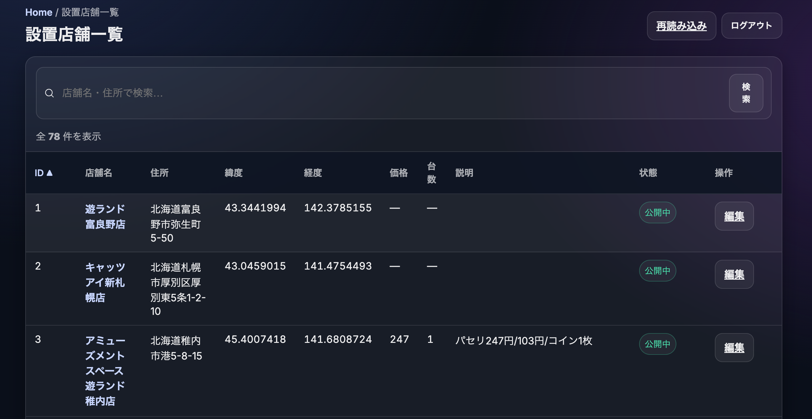
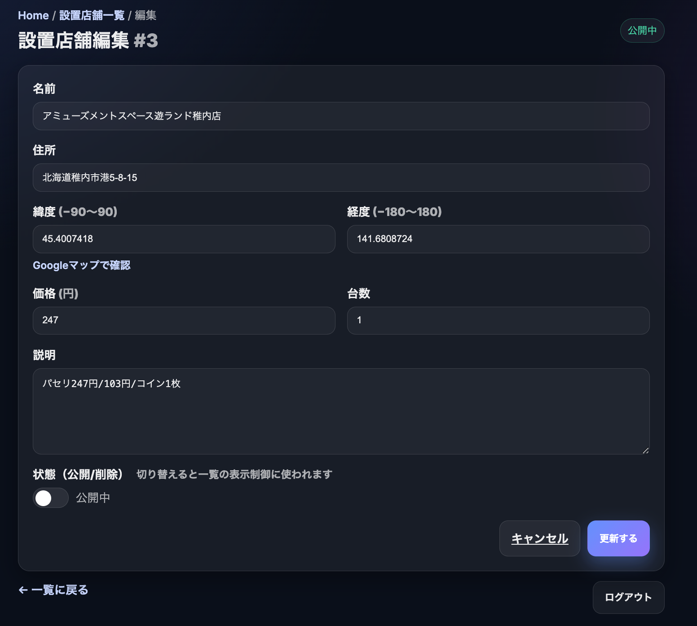
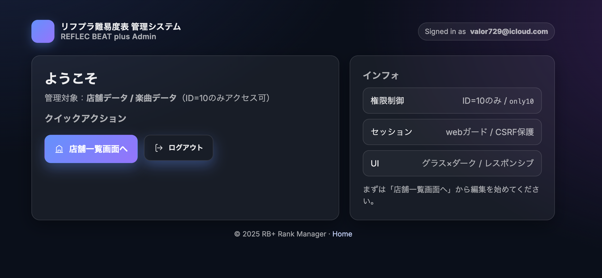

# 概要

本プロジェクトは、[REFLEC BEAT plus レベル11 難易度表＆クリアランク管理サイト](https://rbplus-rank-manager.site/)のバックエンドリポジトリである。

　※フロントエンドのリポジトリは[こちら](https://github.com/misato729/score-manager-frontend)

用途は以下の2つである。

① フロントのAPIリクエスト（スコアの取得・更新、設置店舗の取得など）に返答する。

② Laravel Bladeで開発したバックエンド直結の管理システムで設置店舗情報の管理を行う。

当初は①のみでリリースしていたが、管理システムでデータを管理できた方がサービス運用が楽になると思い、②の開発にも至った。

# 機能一覧
## APIレスポンス
本APIは、フロントエンドとのデータ送受信に利用する。
全エンドポイントは JSON 形式でレスポンスを返す。
認証が必要なエンドポイントは Laravel Sanctum によるトークン認証を使用。

### ユーザー関連
| メソッド   | エンドポイント          | 認証 | 概要                    |
| ------ | ---------------- | -- | --------------------- |
| POST   | `/login`         | 不要 | メールアドレス・パスワードでログイン    |
| POST   | `/register-user` | 不要 | 新規ユーザー登録（スコア初期化含む）    |
| GET    | `/user`          | 必要 | ログイン中ユーザーの情報を取得       |
| POST   | `/logout`        | 必要 | ログアウト（Sanctumトークン無効化） |
| DELETE | `/users/{id}`    | 必要 | ユーザーアカウント削除           |
| PUT    | `/users/target`  | 必要 | ユーザーのターゲットスコア設定を更新    |

### スコア関連
| メソッド | エンドポイント           | 認証 | 概要               |
| ---- | ----------------- | -- | ---------------- |
| GET  | `/scores`         | 不要 | 全ユーザーのスコア一覧を取得   |
| GET  | `/user-scores`    | 不要 | スコア未登録ユーザーのスコア取得 |
| POST | `/scores`         | 必要 | 新しいスコアを登録        |
| PUT  | `/scores/{score}` | 必要 | 既存スコアを更新         |

### 店舗関連
| メソッド | エンドポイント          | 認証 | 概要             |
| ---- | ---------------- | -- | -------------- |
| GET  | `/shops`         | 不要 | 店舗一覧を取得        |
| POST | `/visit`         | 必要 | 行脚店舗を登録        |
| GET  | `/visited`       | 必要 | 自分の行脚店舗履歴を取得   |
| GET  | `/visited-shops` | 不要 | 任意ユーザーの行脚履歴を取得 |

## 管理システム
本管理システムは **Laravel Blade（SSR）** を用いて実装したバックエンド直結の管理画面であり、 API経由ではなく直接データベースにアクセスして管理を行う。

### 機能概要
- **店舗一覧表示**  
  - すべての店舗情報をID順で表示  
  - 店舗名や住所の部分一致検索機能  
  - 公開中／削除済みの状態表示

- **店舗編集**  
  - 店舗名、住所、緯度経度、価格、台数、説明文、論理削除フラグを更新可能  
  - バリデーションチェック付き（必須項目・文字数・数値型）

- **論理削除**  
  - `is_deleted` フラグをON/OFFすることで、実データを残したまま表示制御
- **UIデザイン**  
  - CSSとシンプルなBlade構文によるレスポンシブ対応デザイン 
  - 成功／エラー時のトースト通知表示

### アクセス制御
- Laravel Sanctumによる認証
- ミドルウェアによって、環境変数 `ALLOWED_USER_ID` に設定されたユーザーID（自分）のみアクセス可能
- 未認証時はログイン画面へリダイレクト
- 認証済みでも許可されたID以外はHTTP 403を返却

### 技術ポイント
- Bladeディレクティブ（`@if`, `@foreach`, `@csrf`, `@method` など）を活用
- ルーティングは `routes/web.php` に定義、`AdminShopController` で処理
- 管理画面とAPIのルーティングを分離（`web.php` と `api.php`）
- HTTPS強制設定（`AppServiceProvider` + RenderのForce HTTPS）

### 関連記事
- [Laravel Bladeで管理画面を作ってみた【MVC】](https://qiita.com/misato729/items/138a89c3ad8b3e2f0716)  
  → 管理画面（店舗CRUD）を作る過程を整理した学習アウトプット記事です

# CI/CD
本プロジェクトでは **GitHub Actions + Render** を用いた CI/CD を構築している。  
プルリクエストから本番デプロイまで自動化されており、安全かつ効率的な開発フローを実現している。

- PHPUnitによるFeatureテストを自動実行
- Laravel Factory を活用し、再現性のあるテストデータを生成
- テストが失敗するとマージ不可 (レビュー時に検知)
- `main`ブランチにマージされると Render へ自動デプロイ

# 今後の展望
現在は設置店舗情報の管理機能のみだが、ユーザー管理機能や楽曲管理機能もつけていきたい。
